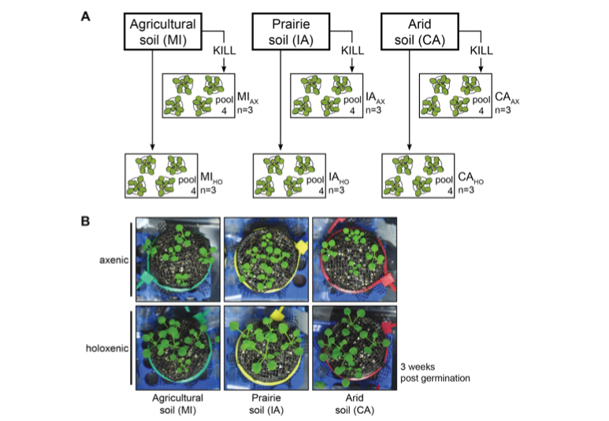

# RNAseq-Arabidopsis-Axenic
RNAseq analysis associated to the article: "Fill the blank"



Sequence data associated with this repository is publicly available at NCBI SRA ""

## Experimental Design


### Libraries:
- Arabidopsis axenic under California Soil  (3 reps)
- Arabidopsis axenic under Iowa Soil        (3 reps)
- Arabidopsis axenic under Michigan Soil    (3 reps)
- Arabidopsis holoxenic under California Soil  (3 reps)
- Arabidopsis holoxenic under California Soil  (3 reps)
- Arabidopsis holoxenic under California Soil  (3 reps)
- Arabidopsis grown under MS (1 rep)

## Methods

### Quality control
Every library was evaluated using [fastQC][fastqc] and visually examined

```bash
#Inside the fastq folder 
fastqc *
```

### Trimming
The first 11bp were trimmed from each library  
Software used: [TrimGalore][trimg]

```bash
#Trim the first 10 nucleotides of every library
trim_galore --hardtrim3 40 --gzip --fastqc -o ../cleanFastq/ *
```

### Mapping
We used the splicing aware mapper [STAR][star]  
Reference genome: TAIR10  (Download from [Phytozome][phyto])  
Annotation files: Araport11 (Download from [Phytozome][phyto]) 

#### Generating genome indexes
Create an STAR index using the reference genome and the GFF3 files
```bash
#create a directory to store the index files
mkdir STAR_index

#create the index with and overhang of 39 (read size after trimming = 40bp) and genomeSA index adjusted to Arabidopsis small genome size.
STAR --runThreadN 3 --runMode genomeGenerate --genomeDir STAR_index/ --genomeFastaFiles Athaliana_447_TAIR10.fa --sjdbGTFfile Annotation/Athaliana_447_Araport11.gene_exons.gff3 --sjdbOverhang 39 --genomeSAindexNbases 12
```
#### Mapping the RNAseq reads back to the genome 
For a single fastq file

```bash
STAR --runThreadN 2 --genomeDir ../DB/STAR_index/ --readFilesCommand gunzip -c --readFilesIn ../cleanFastq/AC1_AACCAG_L001_R1_001.40bp_3prime.fq.gz --alignIntronMin 30 --alignIntronMax 7000 –outFilterIntronMotifs RemoveNoncanonicalUnannotated --outFilterMultimapNmax 20 --outFileNamePrefix ./AC1 --outSAMtype BAM SortedByCoordinate --outReadsUnmapped ./
```
For all the fasta file check [script1][]


<!-- Markdown link & img dfn's -->
[fastQC]: https://www.bioinformatics.babraham.ac.uk/projects/fastqc/
[trimg]: https://github.com/FelixKrueger/TrimGalore
[star]: https://github.com/alexdobin/STAR
[phyto]: https://phytozome.jgi.doe.gov/pz/portal.html#!bulk?org=Org_Athaliana